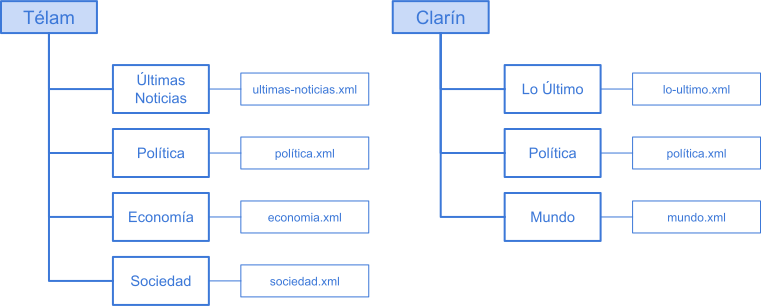

[](https://classroom.github.com/open-in-codespaces?assignment_repo_id=12331784)
<p align="center">
    
</p>

# Estructuras de Datos

## Trabajo Práctico

En este trabajo práctico vamos a construir un sistema de indexación y recuperación de la información orientado a recolectar e indexar noticias publicadas en la Web.

En concreto en este trabajo se deberá:

- Recolectar noticias de los principales medios de comunicación de Argentina.
- Construir un índice (sin compresión) sobre el cuerpo de noticias recolectadas.
- Implementar un sistema de búsqueda que soporte consultas booleanas.
- Escribir un informe.

---

## Primera parte

La primera parte consiste en recopilar una cantidad considerable de noticias para armar el corpus para analizar. Este proceso deberá ser lo más automático posible, es decir, se deberá desarrollar un módulo que consulte periódicamente los canales RSS de los medios de comunicación y almacene las noticias en un archivo XML.

### Recolección de noticias

Se deberá desarrollar este módulo (cuanto antes) a fin de recolectar noticias de la Web. El tamaño mínimo del cuerpo de noticias aceptable será de 200 MB.

Nos vamos a enfocar en las fuentes Web, que suelen publicar sus noticias, clasificadas en diferentes categorías o canales, lo que se conoce como [redifusión Web](https://es.wikipedia.org/wiki/Redifusión_web) o sindicación Web.

Generalmente la información se transmite en formato XML siendo los principales esquemas [RSS](https://es.wikipedia.org/wiki/RSS) y [Atom](https://es.wikipedia.org/wiki/Atom_(formato_de_redifusión)). Estos esquemas proveen de cierta estructura a la información: título, descripción, links, fecha de publicación, etc.

Para la primera parte que consiste en recopilar las noticias se deberá almacenar información de al menos los siguientes canales: últimas noticias, política, sociedad, economía, internacionales, de al menos cinco medios (diarios o agencias de noticias) argentinos, por ejemplo: Telam, Clarín, La Nación, Diario Popular, La Gaceta, La Voz del Interior, etc.

Por ejemplo en la página [http://www.telam.com.ar/rss](http://www.telam.com.ar/rss) se encuentran las URLs para acceder a los siguientes canales:

> Últimas Noticias, Política, Economías, Sociedad, Deportes, Policiales, Internacional, Latinoamérica, Cono Sur, Provincias, Agropecuario, Tecnología, Cultura, Espectáculos, Turismo, Salud, Educación, Redes

En este trabajo sólo vamos a concentrarnos en canales RSS

### Archivo de configuración

El sistema deberá consumir un archivo de configuración que permita parametrizar el comportamiento del mismo. **Las fuentes de noticias no deben esta hardcodeadas en el código**.

En dicho archivo se almacenarán las URLs para acceder a todos los canales utilizados. Se recomienda utilizar el módulo de Python `configparser` para leerlo.

A modo de ejemplo, presentamos un posible archivo de configuración en formato INI:

```ini
[DEFAULT]
query_interval = 600
tmp = ./temp
output = ./salida
...

[TELAM]
url_base = https://www.telam.com.ar
ultimas_noticias = /rss2/ultimasnoticias.xml
politica = /rss2/politica.xml
economia = /rss2/economia.xml
sociedad = /rss2/sociedad.xml
...

[CLARIN]
url_base = https://www.clarin.com
lo_ultimo = /rss/lo-ultimo/
politica = /rss/politica/
mundo = /rss/mundo/
...
```

**Tanto las secciones en el archivo como las opciones de configuración, deberán ser definidas por cada equipo para satisfacer las necesidades del sistema.**

### Estructura del cuerpo de noticias

Por cada medio/canal se deberá almacenar las noticias en el formato XML conservando el formato original (RSS). Es decir, por cada medio/canal se tendrá un gran RSS con todas las noticias recolectadas.

<p align="center">
    
</p>

Esta primera parte que recolecta las noticias deberá consultar las URLs a un intervalo predeterminado y configurable, por ejemplo cada 10 minutos (`query interval`).

### Archivos XML

Los datos recolectados se almacenarán en archivos XML, conservando de la estructura del formato RSS sólo los `<item>` completos.

Como una lectura puede traer varias noticias que ya fueron leídas anteriormente, para evitar llenar archivos con noticias repetidas se deberá controlar los títulos y fechas de publicación para determinar si son noticias repetidas.

## Módulo de búsqueda

En este punto se deberá crear un índice invertido sobre el cuerpo de noticias recolectado e implementar un módulo que permita realizar consultas booleanas sobre el índice.

Para construir el índice se deberá implementar el algoritmo BSBI (_Blocked Sort-Base Indexing_) descrito en la Sección 4.2 del libro _Introduction to Information Retrieval_ (se recomienda una lectura completa de la sección del libro para aclarar conceptos):

### Algoritmo BSBI: Blocked sort-based indexing (simple)

1. Segmenta la colección en partes de igual tamaño.
2. Ordena los pares `(id_termino, id_doc)` de cada parte en memoria.
3. Almacena en disco los resultados intermedios ordenados.
4. Intercala todos los resultados intermedios en un índice final.

El algoritmo genera pares `(id_termino, id_doc)` y los acumula en la memoria hasta que completa un bloque completo (`parse_next_block`).

- El tamaño del bloque se elige para que sea suficientemente grande pero al mismo tiempo se pueda hacer un sort en memoria cómodamente.

El bloque se invierte y se almacena en disco:

1. Ordenar en memoria los pares `(id_termino, id_doc)`.
2. Generar listas de aparición con el mismo id_termino para simplificar (guardar la lista de `id_doc`).
3. Guardar en disco el índice invertido.
4. Intercalar todos los índices invertidos en un índice final.

> “_Para construir un índice, primero hacemos un recorrido por la colección ensamblando todos los pares term-docID. Luego ordenamos los pares con el término como clave dominante y docID como clave secundaria. Finalmente, organizamos los docID para cada término en una lista de publicaciones y calculamos estadísticas como término y frecuencia de documentos. Para colecciones pequeñas, todo esto se puede hacer en la memoria._”

> “_Para hacer que la construcción del índice sea más eficiente, representamos los términos como termID (en lugar de cadenas), donde cada term ID es un número de serie único. Podemos construir el mapeo de términos a termIDs sobre la marcha mientras procesamos la colección. Del mismo modo, también representamos documentos como docID (en lugar de cadenas)._”

Por lo tanto el módulo de construcción del índice deberá contar con una clase que permita mapear los términos (cadena de caracteres) a `termID` (número entero) y `documentos` (cadena de caracteres) a `docID` (número entero).

### Índice invertido sobre el disco

El índice invertido se debe construir paso a paso, a fin de simplificar tomaremos cada agencia de noticias/medio de comunicación como un bloque. El algoritmo solo debe trabajar con un único bloque en memoria, ordenar, invertir y guardar en disco.

Finalmente intercalar todos los bloques invertidos.

Cada bloque queda identificado por el directorio que contiene las noticias. Siguiendo el ejemplo anterior:

- Bloque 1: telam
- Bloque 2: clarin
- …

**Término**: a los efectos de este trabajo práctico, consideramos cada término como cada una de las palabras que forman parte tanto del título como del cuerpo de cada noticia (cada `<item>` del archivo XML).

**Documentos**: los documentos se deberán identificar por el string `f”{medio}-{canal}-{título de la noticia}-{fecha de publicación}”`. Por ejemplo:

```text
Telam-Política-Macri recibe a los subcampeones mundiales de básquetbol 2019-17092019
```

El índice invertido consistirá en un diccionario cuya clave sea el `termID` correspondiente y cuyo valor una 3-tupla de metadata, útil para gestionar la lista de documentos `(posición_inicial_archivo, cant_de_documentos, long_en_bytes)`. Donde:

- `posición_inicial_archivo`: es la posición en bytes del inicio de la lista de documentos donde aparece el término en cuestión, dentro del archivo que contiene todo el índice invertido
- `cant_de_documentos`: es la cantidad de documentos que corresponden este término
- `long_en_bytes`: es la longitud del byte con que se codificaron los docID

Esta estructura se debe mantener en memoria.

### Búsquedas booleanas

El sistema deberá implementar un módulo que permita realizar consultas booleanas sobre el índice invertido construido en la etapa anterior.

El usuario deberá poder ingresar una consulta booleana y devolver como resultado una lista de documentos que satisfacen la consulta.

Por ejemplo, si el usuario ingresa la consulta:

```text
elecciones AND (salud OR educacion)
```

El sistema deberá listar todos los documentos que contengan la palabra `elecciones` y la palabra `salud` o `educacion`.

```text
elecciones AND NOT educacion
```

Es decir, todos los documentos que contengan la palabra `elecciones` y no contengan la palabra `educacion`.

## Entregables

- Informe.
- Código Fuente.
- Cuerpo de noticias comprimido en un archivo ZIP.
